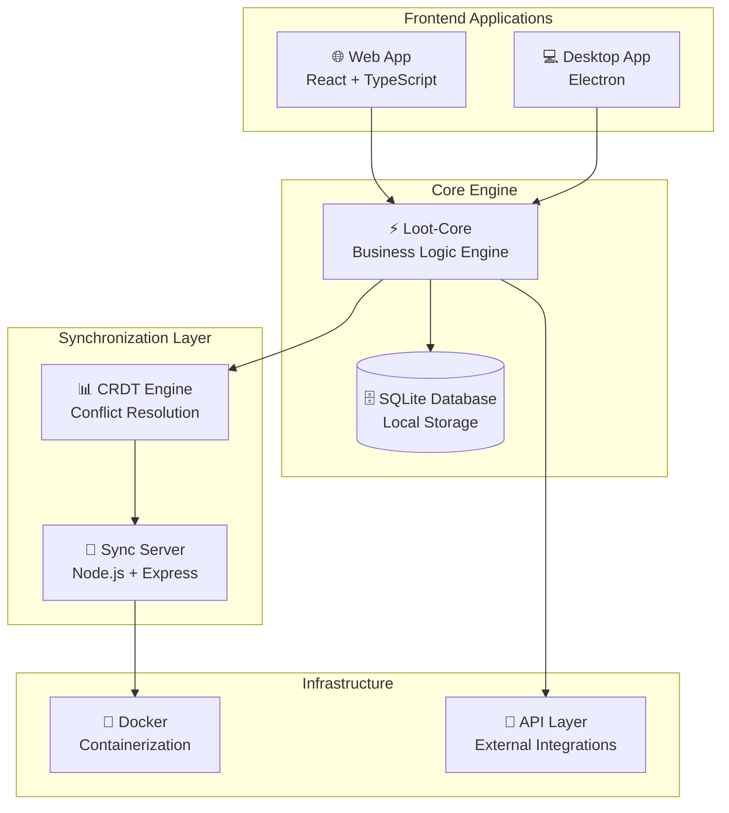
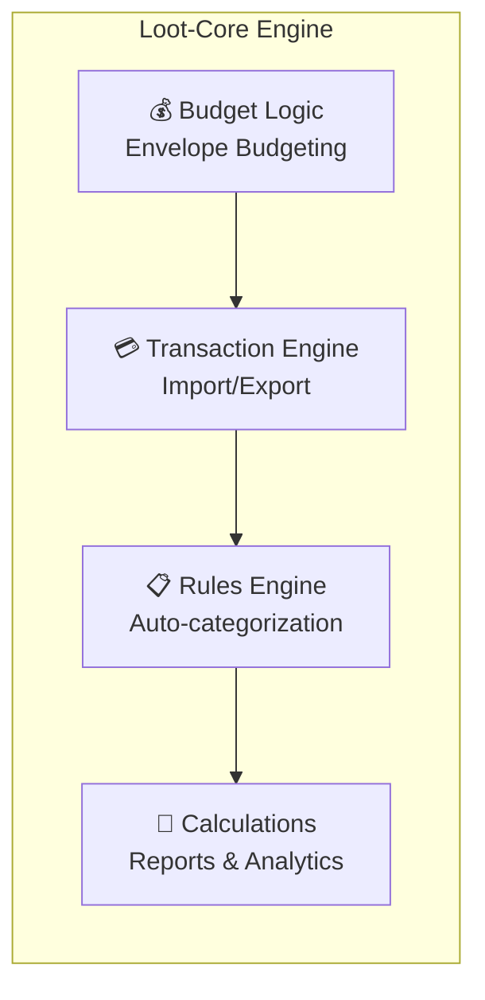
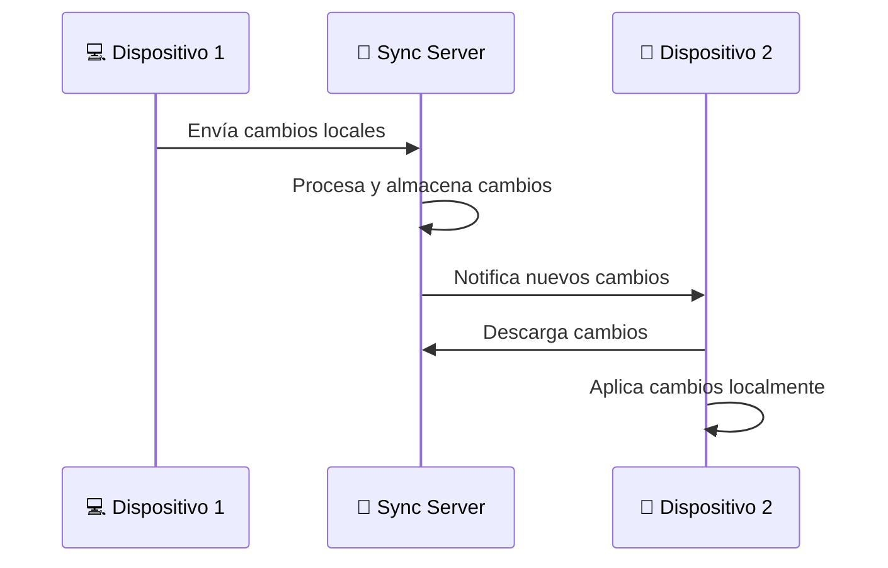
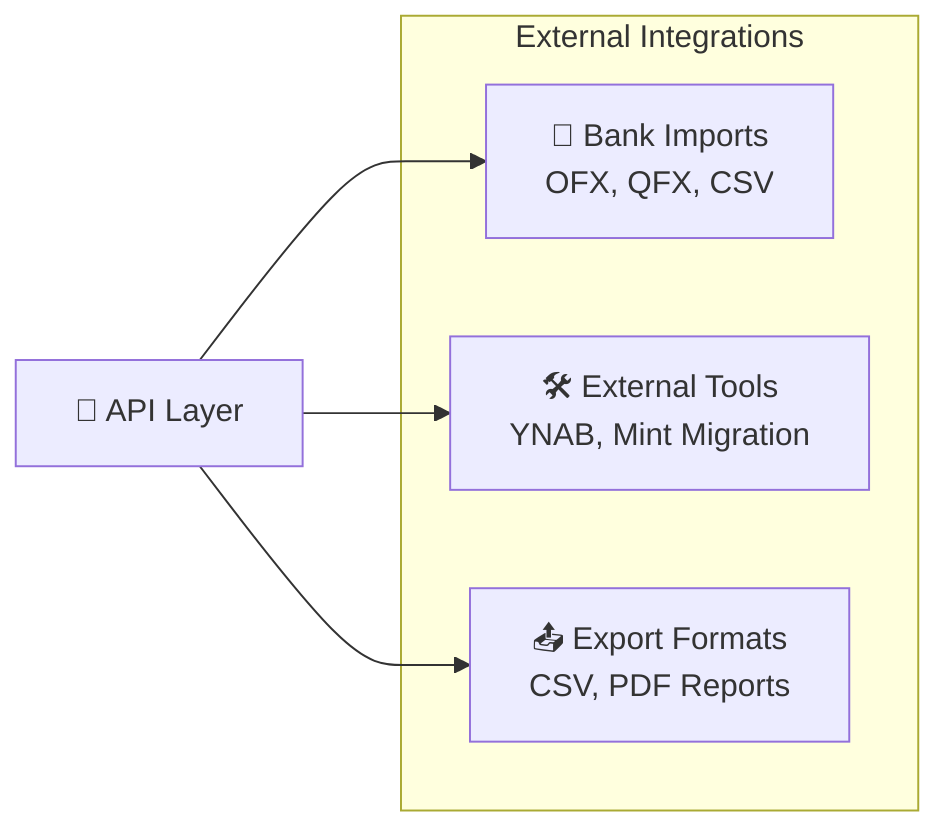
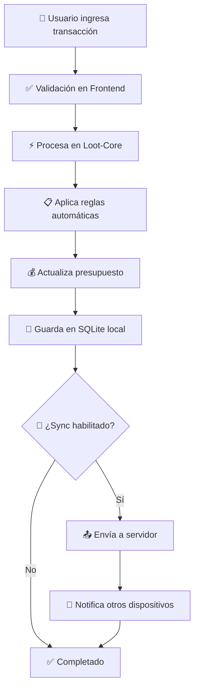
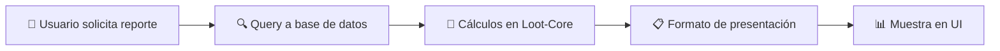
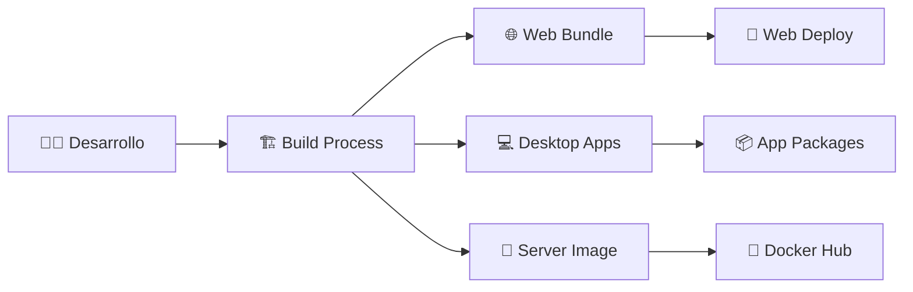
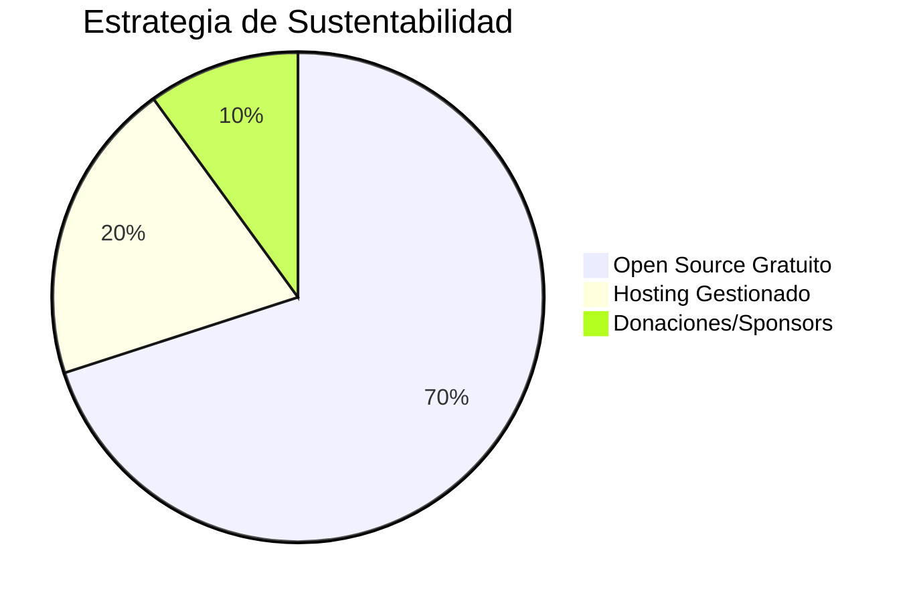
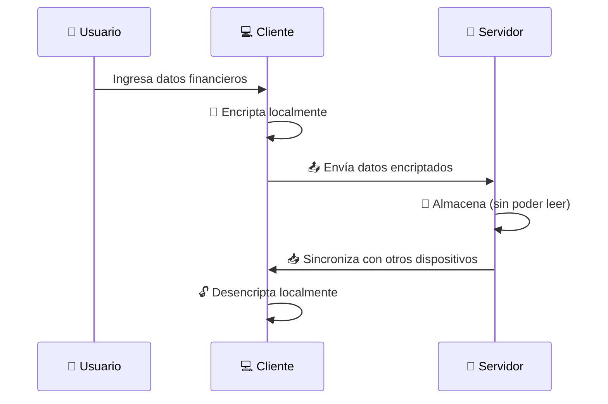
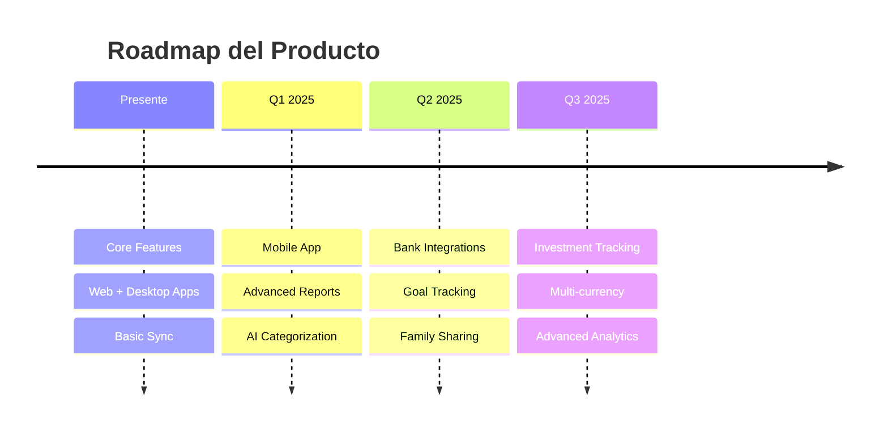

# 📊 Actual Budget - Visión General de la Arquitectura del Producto

## 🎯 ¿Qué es Actual Budget?

Actual Budget es una herramienta de finanzas personales que funciona bajo el principio de "local-first" (primero local). Esto significa que tus datos viven principalmente en tu dispositivo, garantizando privacidad y control total sobre tu información financiera, con capacidad de sincronización opcional entre dispositivos.

### 🔑 Características Principales
- ✅ **100% Gratuito y Open Source**
- 🔒 **Privacidad Total** - Tus datos permanecen en tu dispositivo
- 🔄 **Sincronización Opcional** - Comparte datos entre dispositivos si lo deseas
- 🌐 **Multi-plataforma** - Web, Desktop (Windows, Mac, Linux)
- 📱 **Local-First** - Funciona sin conexión a internet

---

## 🏗️ Arquitectura General del Sistema



---

## 📦 Componentes Principales

### 1. 🎨 **Frontend - Interfaces de Usuario**

#### **Web Application (@actual-app/web)**
- **Propósito**: Interfaz web principal que funciona en cualquier navegador
- **Tecnología**: React + TypeScript + Vite
- **Características**:
  - Dashboard de presupuestos
  - Gestión de cuentas y transacciones
  - Reportes y gráficos
  - Interfaz responsive para diferentes dispositivos

#### **Desktop Application (desktop-electron)**
- **Propósito**: Aplicación nativa para escritorio
- **Tecnología**: Electron (empaqueta la web app)
- **Ventajas**:
  - Experiencia más integrada con el sistema operativo
  - Mejor rendimiento para uso intensivo
  - Acceso a funcionalidades del sistema

### 2. ⚙️ **Motor Central - Loot-Core**

Este es el **corazón** de la aplicación. Piénsalo como el "cerebro" que maneja toda la lógica de negocio.



**Responsabilidades**:
- 💰 **Gestión de Presupuestos**: Implementa el sistema de "envelope budgeting"
- 💳 **Procesamiento de Transacciones**: Import/export de bancos, categorización
- 📊 **Cálculos Financieros**: Balances, proyecciones, reportes
- 🔒 **Seguridad de Datos**: Encriptación y validación

### 3. 🔄 **Servidor de Sincronización (sync-server)**

#### **¿Para qué sirve?**
Imagina que usas Actual en tu computadora de casa y en tu laptop del trabajo. El servidor de sincronización mantiene ambas versiones actualizadas automáticamente.



**Características**:
- 🔒 **Opcional**: Puedes usar Actual completamente offline
- 🏠 **Self-hosted**: Tú controlas dónde viven tus datos
- 🔐 **Seguro**: Los datos están encriptados en tránsito y reposo

### 4. 📊 **CRDT Engine - Resolución de Conflictos**

**¿Qué son los CRDTs?**
CRDT significa "Conflict-free Replicated Data Types". Es una tecnología que permite que múltiples dispositivos modifiquen los mismos datos sin crear conflictos.

**Ejemplo práctico**:
- En tu casa agregas una transacción de $50 en "Comida"
- En el trabajo agregas otra de $30 en "Transporte"
- Ambas se sincronizan automáticamente sin problemas

### 5. 🔌 **API y Integraciones**



---

## 🚀 Flujo de Datos y Operaciones

### 📥 **Flujo de una Transacción Nueva**



### 📊 **Generación de Reportes**



---

## 🛠️ Estructura de Desarrollo

### 📁 **Organización del Código**

```
actual/
├── 📁 packages/
│   ├── 🎨 desktop-client/     # Interfaz web React
│   ├── 💻 desktop-electron/   # App Electron
│   ├── ⚡ loot-core/         # Motor central
│   ├── 🔄 sync-server/       # Servidor sincronización
│   ├── 🔌 api/               # API externa
│   ├── 📊 crdt/              # Manejo de conflictos
│   └── 🧩 component-library/ # Componentes reutilizables
├── 🐳 docker-compose.yml      # Configuración Docker
├── 📋 package.json            # Configuración principal
└── 📚 README.md              # Documentación
```

### 🔄 **Proceso de Build y Deploy**



---

## 🎯 Modelos de Negocio y Deployment

### 🏠 **Opciones de Instalación**

| Opción | Audiencia | Complejidad | Control |
|--------|-----------|-------------|----------|
| 🌐 **Web Local** | Usuarios técnicos | Media | Total |
| 💻 **Desktop Apps** | Usuarios generales | Baja | Total |
| ☁️ **PikaPods** | No técnicos | Muy baja | Medio |
| 🚁 **Fly.io** | Semi-técnicos | Baja | Alto |
| 🐳 **Docker Self-hosted** | Técnicos | Alta | Total |

### 💰 **Modelo de Monetización**



---

## 🔒 **Seguridad y Privacidad**

### 🛡️ **Principios de Seguridad**

1. **🏠 Local-First**: Los datos viven en tu dispositivo
2. **🔐 Encriptación**: Datos encriptados en tránsito y reposo
3. **🔒 Zero-Knowledge**: El servidor no puede leer tus datos
4. **📱 Control Total**: Tú decides qué sincronizar y dónde

### 🔐 **Flujo de Seguridad**



---

## 🎨 **Experiencia del Usuario**

### 📱 **Interfaces Principales**

1. **📊 Dashboard**
   - Vista general del presupuesto
   - Gráficos de gastos por categoría
   - Alertas y notificaciones

2. **💳 Gestión de Transacciones**
   - Import automático desde bancos
   - Categorización inteligente
   - Reglas automáticas

3. **💰 Presupuesto (Envelope Method)**
   - Asignación de dinero a categorías
   - Seguimiento de gastos vs presupuesto
   - Proyecciones futuras

4. **📈 Reportes y Analytics**
   - Tendencias de gastos
   - Comparativas mensuales
   - Objetivos de ahorro

---

## 🚀 **Roadmap y Evolución**

### 🎯 **Ventajas Competitivas**

- ✅ **Privacidad Total**: A diferencia de Mint o Personal Capital
- ✅ **Control Completo**: No dependes de servicios externos
- ✅ **Gratuito**: Sin suscripciones mensuales
- ✅ **Open Source**: Transparencia total del código
- ✅ **Multi-plataforma**: Funciona en cualquier dispositivo

### 🔮 **Visión Futura**



---

## 🤝 **Comunidad y Contribuciones**

### 👥 **Ecosistema**

- **📝 Documentación**: [actualbudget.org](https://actualbudget.org)
- **💬 Discord**: Comunidad activa de usuarios
- **🐛 GitHub Issues**: Reportes de bugs y features
- **🌍 Traducciones**: Soporte multi-idioma via Weblate

### 🏆 **Métricas de Éxito**

- ⭐ **+15,000 stars** en GitHub
- 👥 **Comunidad activa** de contributores
- 🌍 **Uso global** en múltiples idiomas
- 📈 **Crecimiento constante** de usuarios

---

## 💡 **Conclusión**

Actual Budget representa una nueva generación de herramientas financieras que prioriza:

1. **👤 Control del Usuario**: Tú posees y controlas tus datos
2. **🔒 Privacidad**: Datos locales, encriptación end-to-end
3. **🆓 Accesibilidad**: Completamente gratuito y open source
4. **🛠️ Flexibilidad**: Multiple opciones de deployment
5. **🌍 Comunidad**: Desarrollo colaborativo y transparente

Esta arquitectura permite que usuarios desde principiantes hasta expertos en finanzas encuentren valor en la herramienta, mientras mantienen control total sobre su información financiera más sensible.

---

*📝 Documento generado como Product Manager Overview - Para detalles técnicos específicos, consultar la documentación de desarrollo en `/docs/contributing/`*
