# 🗄️ Actual Budget - Arquitectura de Almacenamiento y Bases de Datos

## 📋 Resumen Ejecutivo

Actual Budget implementa una arquitectura de datos híbrida "**Local-First**" que combina almacenamiento local SQLite con sincronización opcional. Los datos financieros del usuario **siempre** viven primariamente en su dispositivo, garantizando privacidad y control total.

---

## 🏗️ Arquitectura General de Datos

```mermaid
graph TB
    subgraph "🖥️ Dispositivo del Usuario"
        CLIENT[📱 Cliente Actual]
        LOCAL_DB[(🗄️ SQLite Local<br/>db.sqlite)]
        WEB_STORAGE[🌐 IndexedDB<br/>(Versión Web)]
    end
    
    subgraph "☁️ Servidor de Sincronización (Opcional)"
        SYNC_SERVER[🔄 Sync Server]
        ACCOUNT_DB[(👥 account.sqlite<br/>Usuarios & Permisos)]
        USER_FILES[(📁 user-files/<br/>group-{id}.sqlite)]
        MESSAGES[(📨 Messages<br/>Cambios CRDT)]
    end
    
    CLIENT --> LOCAL_DB
    CLIENT --> WEB_STORAGE
    CLIENT <--> SYNC_SERVER
    SYNC_SERVER --> ACCOUNT_DB
    SYNC_SERVER --> USER_FILES
    SYNC_SERVER --> MESSAGES
    
    style LOCAL_DB fill:#e1f5fe
    style WEB_STORAGE fill:#f3e5f5
    style ACCOUNT_DB fill:#fff3e0
    style USER_FILES fill:#e8f5e8
```

---

## 🏠 **1. Almacenamiento Local (Primario)**

### 📱 **Cliente Local - SQLite Database**

**Ubicación**: `{proyecto}/data/db.sqlite`

Esta es la **fuente de verdad** principal donde viven todos los datos financieros del usuario:

#### **🗃️ Estructura Principal de Tablas**

```sql
-- 💰 Datos Financieros Core
CREATE TABLE accounts (
    id TEXT PRIMARY KEY,           -- UUID único de cuenta
    name TEXT,                     -- "Cuenta Corriente Banco X"
    balance_current INTEGER,       -- Balance en centavos
    balance_available INTEGER,     -- Disponible para gastar
    type TEXT,                     -- "checking", "savings", "credit"
    bank TEXT,                     -- Referencia al banco
    offbudget INTEGER DEFAULT 0    -- ¿Fuera del presupuesto?
);

CREATE TABLE transactions (
    id TEXT PRIMARY KEY,           -- UUID de transacción
    acct TEXT,                     -- Referencia a account.id
    category TEXT,                 -- Categoría de gasto
    amount INTEGER,                -- Cantidad en centavos
    description TEXT,              -- "Starbucks Coffee"
    date INTEGER,                  -- Timestamp
    imported_description TEXT,     -- Descripción original del banco
    transferred_id TEXT            -- Para transferencias entre cuentas
);

CREATE TABLE categories (
    id TEXT PRIMARY KEY,           -- UUID de categoría
    name TEXT,                     -- "Comida", "Transporte"
    cat_group TEXT,                -- Referencia a grupo
    is_income INTEGER DEFAULT 0    -- ¿Es ingreso?
);

-- 📊 Sistema de Presupuestos (Envelope Method)
CREATE TABLE spreadsheet_cells (
    name TEXT PRIMARY KEY,         -- "budget-2024-01-food"
    expr TEXT,                     -- Fórmula o valor
    cachedValue TEXT               -- Resultado calculado
);
```

#### **💾 Características del Almacenamiento Local**

- ✅ **Privacidad Total**: Los datos nunca salen del dispositivo sin tu consentimiento
- ✅ **Funcionamiento Offline**: Funciona sin conexión a internet
- ✅ **Rendimiento**: Consultas instantáneas al ser local
- ✅ **Backup Local**: Backups automáticos locales
- ✅ **Encriptación**: Los datos pueden estar encriptados en reposo

### 🌐 **Versión Web - IndexedDB**

Para la versión que funciona en navegadores web:

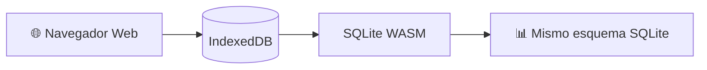

**Tecnología**: 
- **absurd-sql**: Adapta SQLite para funcionar en navegadores
- **IndexedDB**: Storage nativo del navegador
- **sql.js**: SQLite compilado a WebAssembly

---

## ☁️ **2. Servidor de Sincronización (Opcional)**

### 🎯 **Propósito del Servidor**

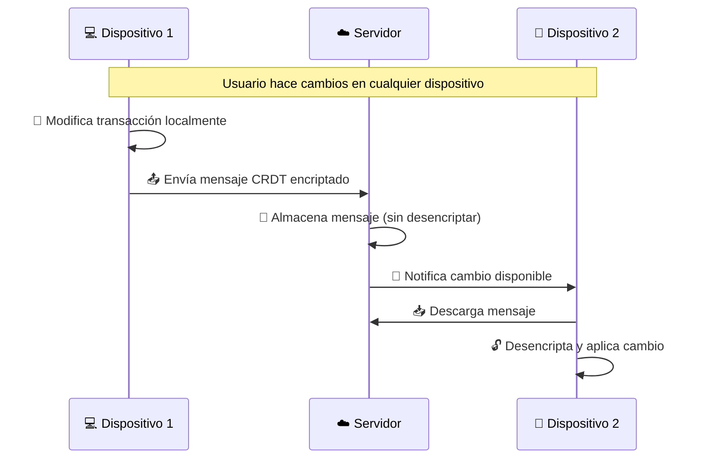

### 🗄️ **Bases de Datos del Servidor**

#### **👥 Account Database (`account.sqlite`)**

**Ubicación**: `{serverFiles}/account.sqlite`

Maneja autenticación y permisos (NO datos financieros):

```sql
-- 👤 Gestión de Usuarios
CREATE TABLE users (
    id TEXT PRIMARY KEY,           -- UUID del usuario
    user_name TEXT,                -- Username o email
    display_name TEXT,             -- Nombre para mostrar
    enabled INTEGER,               -- ¿Usuario activo?
    owner INTEGER DEFAULT 0,       -- ¿Es administrador?
    role TEXT                      -- "BASIC", "ADMIN"
);

-- 📁 Registro de Archivos de Presupuesto
CREATE TABLE files (
    id TEXT PRIMARY KEY,           -- UUID del presupuesto
    owner TEXT,                    -- user.id del propietario
    name TEXT,                     -- "Mi Presupuesto Familiar"
    created_at TEXT               -- Timestamp de creación
);

-- 🔐 Métodos de Autenticación
CREATE TABLE auth (
    method TEXT,                   -- "password", "openid"
    display_name TEXT,             -- "Email/Password"
    active INTEGER                 -- ¿Método activo?
);
```

#### **📁 User Files (`group-{groupId}.sqlite`)**

**Ubicación**: `{userFiles}/group-{groupId}.sqlite`

Una base de datos **por cada presupuesto** compartido:

```sql
-- 📨 Mensajes de Sincronización (CRDT)
CREATE TABLE messages_binary (
    timestamp TEXT PRIMARY KEY,    -- Timestamp único
    is_encrypted BOOLEAN,          -- ¿Mensaje encriptado?
    content BYTEA                  -- Contenido del mensaje CRDT
);

-- 🌳 Merkle Tree para verificación
CREATE TABLE messages_merkles (
    id INTEGER PRIMARY KEY,
    merkle TEXT                    -- Hash para verificar integridad
);
```

---

## 🔄 **3. Sistema CRDT - Resolución de Conflictos**

### ❓ **¿Qué son los CRDTs?**

**CRDT** = Conflict-free Replicated Data Types

Son estructuras de datos que pueden ser modificadas simultáneamente en múltiples dispositivos sin crear conflictos.

### 🔧 **Cómo Funciona en Actual**

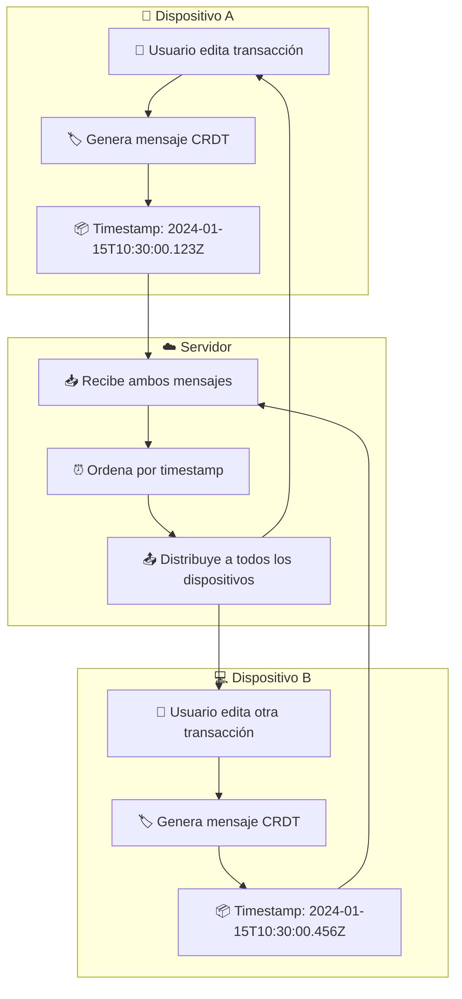

### 📨 **Estructura de un Mensaje CRDT**

```javascript
{
  "timestamp": "2024-01-15T10:30:00.123Z-client-abc123",
  "dataset": "transactions",          // Tabla afectada
  "row": "trans-uuid-123",           // ID del registro
  "column": "amount",                // Campo modificado
  "value": 4500,                     // Nuevo valor (centavos)
  "encrypted": true                  // ¿Está encriptado?
}
```

---

## 🗂️ **4. Organización Física de Archivos**

### 🏠 **En el Dispositivo del Usuario**

```
📁 actual-budget/
├── 📄 db.sqlite                    # Base de datos principal
├── 📁 backups/                     # Backups automáticos locales
│   ├── 📄 backup-2024-01-15.sqlite
│   └── 📄 backup-2024-01-14.sqlite
├── 📄 metadata.json               # Configuración local
└── 📁 attachments/                # Recibos, documentos
    ├── 📄 receipt-001.pdf
    └── 📄 invoice-002.jpg
```

### ☁️ **En el Servidor (Self-hosted)**

```
📁 server-files/                   # Configuración del servidor
├── 📄 account.sqlite              # Usuarios y autenticación
└── 📄 config.json                # Configuración del servidor

📁 user-files/                     # Datos de sincronización
├── 📄 group-family-budget.sqlite  # Mensajes CRDT del presupuesto familiar
├── 📄 group-personal.sqlite       # Mensajes CRDT del presupuesto personal
└── 📄 group-business.sqlite       # Mensajes CRDT del presupuesto de negocio
```

---

## 🔒 **5. Seguridad y Encriptación**

### 🛡️ **Principios de Seguridad**

```mermaid
flowchart LR
    subgraph "🖥️ Cliente"
        PLAIN[📊 Datos en Claro]
        ENCRYPT[🔐 Encriptación Local]
        SEND[📤 Envío Encriptado]
    end
    
    subgraph "☁️ Servidor"
        RECEIVE[📥 Recibe Encriptado]
        STORE[💾 Almacena Encriptado]
        FORWARD[📤 Reenvía Encriptado]
    end
    
    subgraph "📱 Otro Cliente"
        RECV2[📥 Recibe Encriptado]
        DECRYPT[🔓 Desencripta Local]
        PLAIN2[📊 Datos en Claro]
    end
    
    PLAIN --> ENCRYPT --> SEND
    SEND --> RECEIVE --> STORE
    STORE --> FORWARD --> RECV2 --> DECRYPT --> PLAIN2
    
    style ENCRYPT fill:#ffebee
    style STORE fill:#ffebee
    style DECRYPT fill:#ffebee
```

### 🔑 **Modelo de Encriptación**

1. **🔐 End-to-End**: Los datos se encriptan antes de salir del dispositivo
2. **🔒 Zero-Knowledge**: El servidor nunca puede leer los datos financieros
3. **🗝️ Derivación de Claves**: Las claves se derivan de la contraseña del usuario
4. **🛡️ Integridad**: Merkle trees verifican que los datos no han sido alterados

---

## 📊 **6. Flujo de Datos en Operaciones Comunes**

### 💳 **Agregar Nueva Transacción**

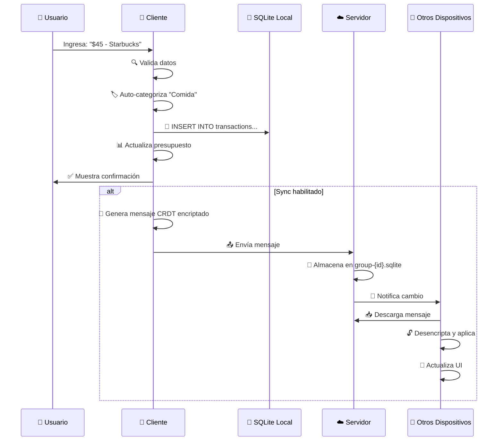

### 📈 **Generar Reporte de Gastos**

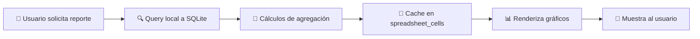

---

## 🚀 **7. Escalabilidad y Rendimiento**

### 📈 **Limitaciones y Capacidades**

| Aspecto | Local | Con Servidor |
|---------|-------|--------------|
| **Transacciones** | 500,000+ | Ilimitadas |
| **Cuentas** | 100+ | Ilimitadas |
| **Usuarios Concurrentes** | 1 | 1000+ |
| **Dispositivos por Usuario** | N/A | 10+ |
| **Almacenamiento** | Limitado por disco | Limitado por servidor |
| **Latencia Queries** | <1ms | <50ms |

### ⚡ **Optimizaciones de Rendimiento**

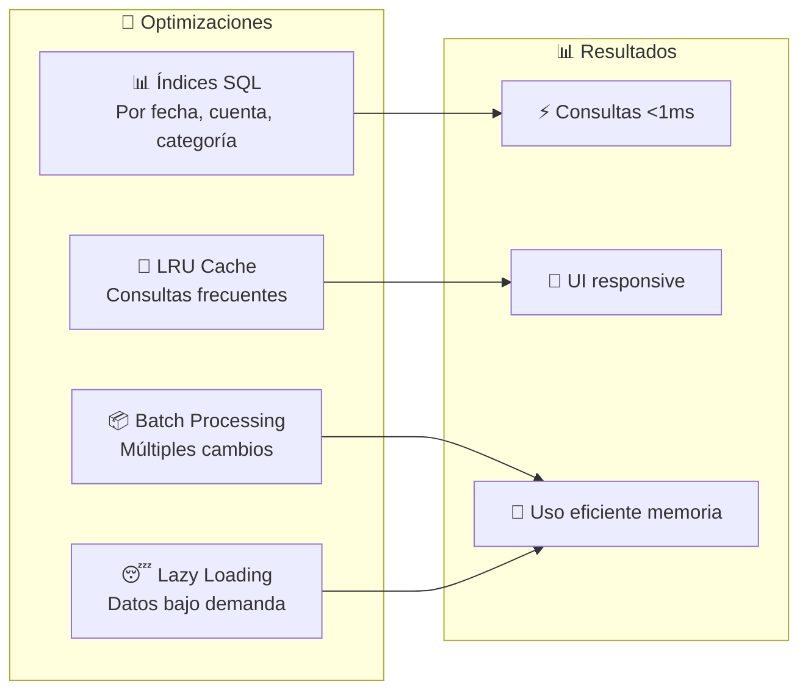

---

## 🛠️ **8. Backup y Recuperación**

### 💾 **Estrategias de Backup**

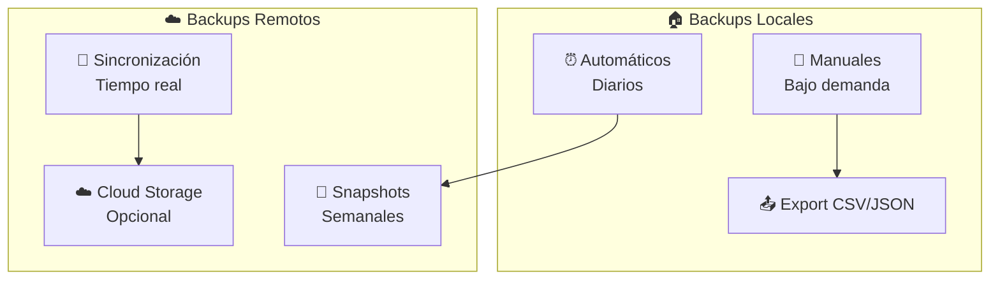

### 🔄 **Proceso de Recuperación**

1. **📱 Pérdida de Dispositivo**: Instalar app + login = datos restaurados
2. **💾 Corrupción Local**: Restaurar desde backup local más reciente  
3. **☁️ Pérdida Total**: Servidor mantiene copia de todos los cambios
4. **🔐 Pérdida de Contraseña**: Los datos quedan encriptados para siempre

---

## 🌍 **9. Modelos de Deployment**

### 🏠 **Solo Local (Sin Servidor)**

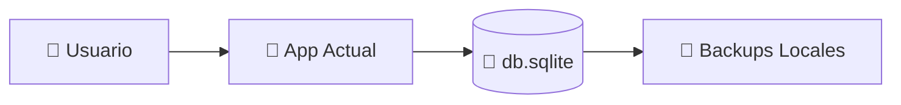

**Pros**: Privacidad total, sin costos, sin dependencias
**Contras**: Sin sincronización, backups manuales

### ☁️ **Con Servidor Self-hosted**

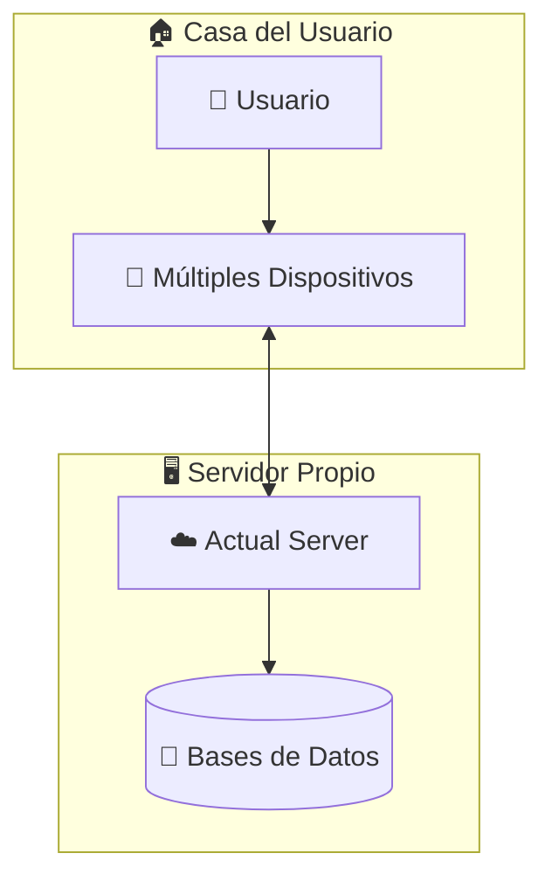

**Pros**: Control total, sincronización, multi-dispositivo
**Contras**: Requiere server, mantenimiento técnico

### ☁️ **Hosting Gestionado (PikaPods, Fly.io)**

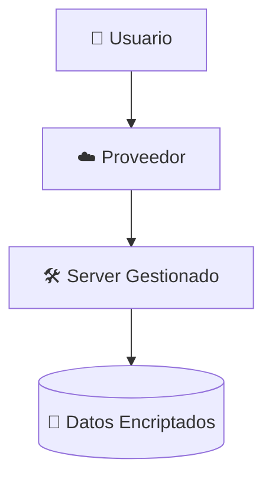

**Pros**: Sin mantenimiento, backups automáticos, disponibilidad 24/7
**Contras**: Costo mensual (~$1.50), dependencia externa

---

## 📊 **10. Comparación con Alternativas**

| Característica | Actual Budget | Mint | YNAB | Personal Capital |
|----------------|---------------|------|------|------------------|
| **Datos Locales** | ✅ Sí | ❌ No | ❌ No | ❌ No |
| **Encriptación E2E** | ✅ Sí | ❌ No | ❌ No | ❌ No |
| **Self-hosted** | ✅ Sí | ❌ No | ❌ No | ❌ No |
| **Offline** | ✅ Sí | ❌ No | ❌ No | ❌ No |
| **Open Source** | ✅ Sí | ❌ No | ❌ No | ❌ No |
| **Costo** | 🆓 Gratis | 🆓 Gratis | 💰 $14/mes | 🆓 Gratis |
| **Bank Sync** | 🔄 Manual | ✅ Auto | ✅ Auto | ✅ Auto |

---

## 🎯 **Conclusiones**

### ✅ **Fortalezas del Modelo de Datos**

1. **🔒 Privacidad Total**: Los datos nunca salen del control del usuario
2. **⚡ Rendimiento**: Consultas instantáneas al ser locales
3. **🛡️ Seguridad**: Encriptación end-to-end y zero-knowledge
4. **🔄 Flexibilidad**: Funciona offline y online
5. **💾 Durabilidad**: Múltiples niveles de backup

### 🎪 **Casos de Uso Ideales**

- **👤 Usuarios privacy-conscious** que no confían en servicios cloud
- **🏢 Empresas** que requieren control total de datos financieros
- **🌍 Usuarios internacionales** sin acceso a servicios US
- **🔧 Usuarios técnicos** que quieren self-hosting
- **🏠 Familias** que quieren compartir presupuestos de forma segura

### 🚀 **Evolución Futura**

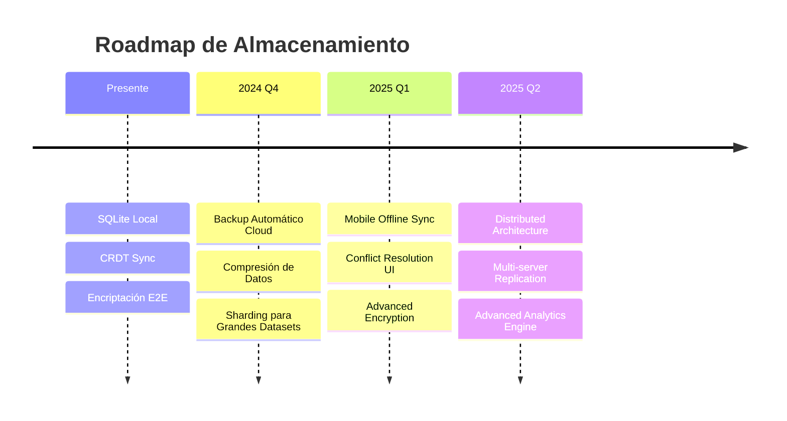

---

**🎓 Este modelo de almacenamiento representa la evolución natural de las aplicaciones financieras: devolver el control de los datos a los usuarios sin sacrificar funcionalidad o experiencia.**

*📝 Documento técnico generado para explicar la arquitectura de almacenamiento y persistencia de datos en Actual Budget*
