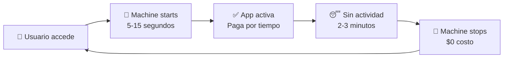

# 🚁 Fly.io vs Otras Opciones - Análisis Completo para Actual Budget

## 🎯 **¿Por qué Actual recomienda Fly.io?**

### ✅ **Razones Técnicas**
1. **🐳 Docker nativo** - Actual ya está containerizado
2. **🌍 Global edge network** - Latencia baja en todo el mundo  
3. **📦 Single platform** - No necesitas múltiples servicios
4. **🔄 Auto-scaling** - Se adapta al uso real
5. **💾 Persistent volumes** - Para datos SQLite
6. **🛠️ Simple deployment** - Un comando y listo

### 🏆 **Ventajas específicas para tu caso**
- ✅ **Una sola plataforma** (vs Railway + Supabase)
- ✅ **SQLite nativo** (no necesitas PostgreSQL)
- ✅ **Auto-stop/start** (ahorro de costos)
- ✅ **CLI excelente** (automatización fácil)

---

## 💰 **Costos Reales de Fly.io para Actual**

### 📊 **Configuración Recomendada para Actual**

```toml
# fly.toml
[build]
  image = "actualbudget/actual-server:latest"

[[services]]
  http_checks = []
  internal_port = 5006
  processes = ["app"]
  protocol = "tcp"
  auto_stop_machines = true    # 🔥 CLAVE para ahorrar
  auto_start_machines = true   # 🔥 CLAVE para ahorrar

[http_service]
  internal_port = 5006
  force_https = true
  auto_stop_machines = true
  auto_start_machines = true

[[vm]]
  cpu_kind = "shared"     # Más barato
  cpus = 1
  memory_mb = 256         # Suficiente para Actual
```

### 💵 **Cálculo de Costos Mensual**

| Recurso | Configuración | Costo/hora | Horas activas* | Costo mensual |
|---------|---------------|------------|----------------|---------------|
| **Compute** | 1 shared CPU, 256MB | $0.0000075 | 100h | **$0.75** |
| **Storage** | 1GB Volume | - | 30 días | **$0.15** |
| **IPv4** | Dedicated (opcional) | - | 30 días | **$2.00** |
| **Data transfer** | 10GB/mes | $0.02/GB | - | **$0.20** |
| **Total estimado** | | | | **$1.10 - $3.10/mes** |

*Con auto-stop, solo paga cuando alguien usa la app (~3-4h/día para uso personal)

### 🔥 **Auto-Stop = Súper Ahorro**



**Resultado**: Solo pagas ~100-150 horas/mes en lugar de 744h completas

---

## 🔍 **Comparación Final: Fly.io vs Railway + Supabase**

| Aspecto | 🚁 Fly.io | 🚄 Railway + Supabase |
|---------|-----------|----------------------|
| **Simplicidad** | ⭐⭐⭐⭐⭐ Una plataforma | ⭐⭐⭐ Dos plataformas |
| **Costo mensual** | **$1-3/mes** | **$0-5/mes** inicial |
| **Escalabilidad** | ⭐⭐⭐⭐⭐ Automática | ⭐⭐⭐⭐ Manual |
| **Base de datos** | SQLite (nativo Actual) | PostgreSQL (más potente) |
| **Integraciones** | APIs custom necesarias | Supabase APIs automáticas |
| **Global reach** | ⭐⭐⭐⭐⭐ 30+ regiones | ⭐⭐⭐ Limitado |
| **Cold starts** | ❌ 5-15s con auto-stop | ✅ Siempre activo |

---

## 🏆 **Mi Recomendación Actualizada**

### 🥇 **Para tu caso específico: Fly.io GANA**

**¿Por qué?**

1. **🎯 Simplicidad**: Una sola plataforma, una sola factura
2. **💰 Costo real bajo**: $1-3/mes con auto-stop
3. **🔧 Menos complejidad**: No manejar dos servicios
4. **📱 Perfecto para bots**: Webhooks + APIs custom simples
5. **🌍 Global**: Mejor latencia para usuarios internacionales

### 📋 **Plan de Implementación con Fly.io**

#### **Fase 1: Setup Básico (2-3 horas)**
```bash
# 1. Instalar Fly CLI
curl -L https://fly.io/install.sh | sh

# 2. Login y crear app
fly auth login
fly launch --image actualbudget/actual-server:latest

# 3. Configurar auto-stop (ahorro de costos)
fly scale show
fly scale count 1
```

#### **Fase 2: Customización (4-6 horas)**
```bash
# 1. Fork del repo Actual
git clone tu-fork-actual
cd actual-budget-custom

# 2. Agregar integraciones custom
mkdir integrations/
# - telegram-bot.js
# - ai-agent.js  
# - custom-apis.js

# 3. Build y deploy custom
fly deploy
```

#### **Fase 3: Integraciones (6-8 horas)**
- 🤖 **Telegram Bot**: Webhooks a tu app Fly
- 🧠 **AI Agent**: OpenAI API para categorización
- 📊 **Dashboard custom**: Panel de administración
- 🔗 **APIs custom**: Endpoints para automación

---

## 🚀 **Setup Inicial - Comandos Exactos**

### **1. Preparar fly.toml optimizado**

```toml
# fly.toml
app = "tu-actual-budget"
primary_region = "mia"  # Miami para latencia en América

[build]
  image = "actualbudget/actual-server:latest"

[env]
  ACTUAL_PORT = "5006"
  ACTUAL_HOSTNAME = "0.0.0.0"

[[mounts]]
  source = "actual_data"
  destination = "/data"

[[services]]
  http_checks = []
  internal_port = 5006
  processes = ["app"]
  protocol = "tcp"
  auto_stop_machines = true    # 💰 AHORRO CLAVE
  auto_start_machines = true   # 💰 AHORRO CLAVE

  [[services.ports]]
    port = 80
    handlers = ["http"]
    force_https = true

  [[services.ports]]
    port = 443
    handlers = ["tls", "http"]

[http_service]
  internal_port = 5006
  force_https = true
  auto_stop_machines = true
  auto_start_machines = true

[[vm]]
  cpu_kind = "shared"
  cpus = 1
  memory_mb = 512  # Un poco más para tus customizaciones
```

### **2. Comandos de deploy**

```bash
# Crear volume persistente para datos
fly volumes create actual_data --region mia --size 1

# Launch con configuración optimizada
fly launch --no-deploy
fly deploy

# Verificar que funciona
fly open
fly logs
```

### **3. Agregar tus customizaciones** (Out of scope inicial)

```dockerfile
# Dockerfile.custom
FROM actualbudget/actual-server:latest

# Agregar tus integraciones
COPY integrations/ /app/integrations/
COPY custom-routes/ /app/custom-routes/

# Instalar dependencias adicionales
RUN npm install telegram-bot-api openai

# Exponer variables para integraciones
ENV TELEGRAM_BOT_TOKEN=""
ENV OPENAI_API_KEY=""

CMD ["node", "app.js"]
```

---

## 💡 **Ventajas Adicionales de Fly.io**

### 🔧 **Para Desarrollo**
- 🚀 **Deploy en segundos**: `fly deploy`
- 📊 **Logs en vivo**: `fly logs`
- 🐛 **SSH a la app**: `fly ssh console`
- 📈 **Métricas incluidas**: Dashboard web

### 🌍 **Para Producción**
- 🛡️ **SSL automático**: Let's Encrypt incluido
- 🔄 **Health checks**: Restart automático si falla
- 📍 **Multi-región**: Despliega cerca de tus usuarios
- 🔐 **Secrets management**: Variables seguras

### 🤖 **Para tus Integraciones**
- 📡 **Webhooks simples**: URL directa a tu app
- 🔗 **APIs custom**: Express.js completo disponible
- 📱 **Telegram Bot**: Webhook directo, sin servicios extra
- 🧠 **AI Agents**: Procesar en la misma instancia

---

## ✅ **Decisión Final**

**Para tu caso (customización + bots + siempre activo + económico):**

### 🏆 **Fly.io es la mejor opción porque:**
1. ✅ **$1-3/mes reales** (con auto-stop inteligente)
2. ✅ **Una sola plataforma** (menos complejidad) 
3. ✅ **Actual ya está optimizado** para Fly.io
4. ✅ **Perfect para bots** (webhooks directos)
5. ✅ **Escalabilidad automática** (crece contigo)
6. ✅ **SQLite nativo** (no necesitas PostgreSQL)

**¿Empezamos con Fly.io?** Puedo ayudarte paso a paso con:
- 🚀 Setup inicial optimizado
- 🤖 Integración de Telegram Bot  
- 🧠 AI Agent para categorización
- 📊 Dashboard de administración custom

**Comandos útiles para gestionar tu app:**
``` bash
flyctl status                   # Ver estado
flyctl logs                     # Ver logs en vivo  
flyctl ssh console              # Conectar por SSH
flyctl scale show               # Ver configuración actual
flyctl dashboard                # Abrir panel web de Fly.io
```
