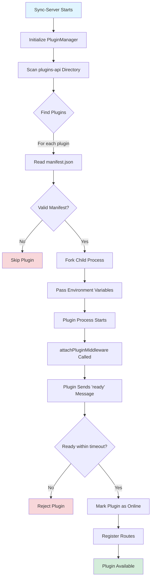
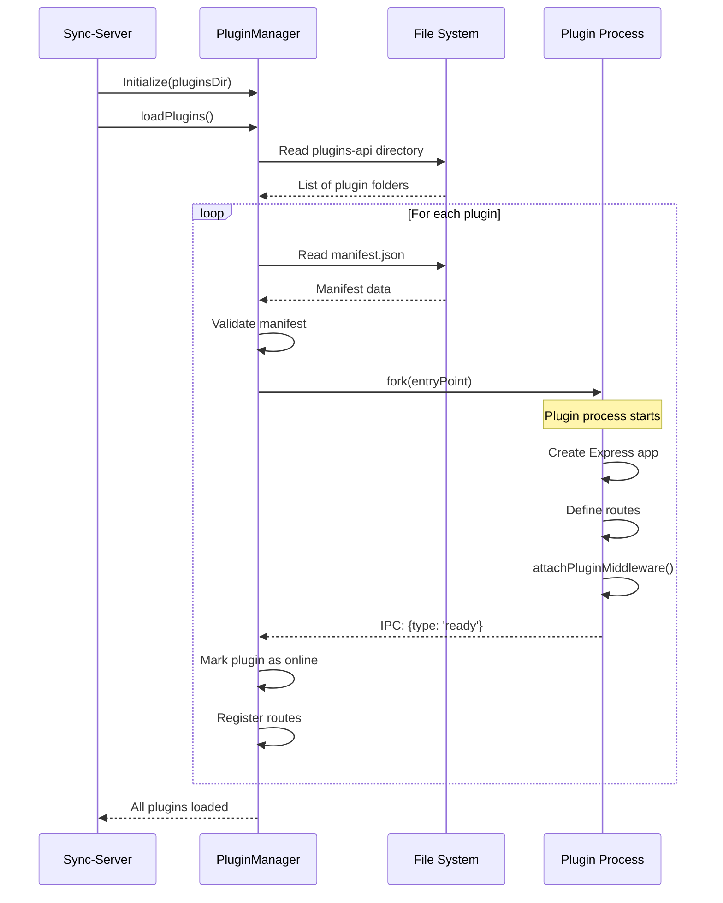
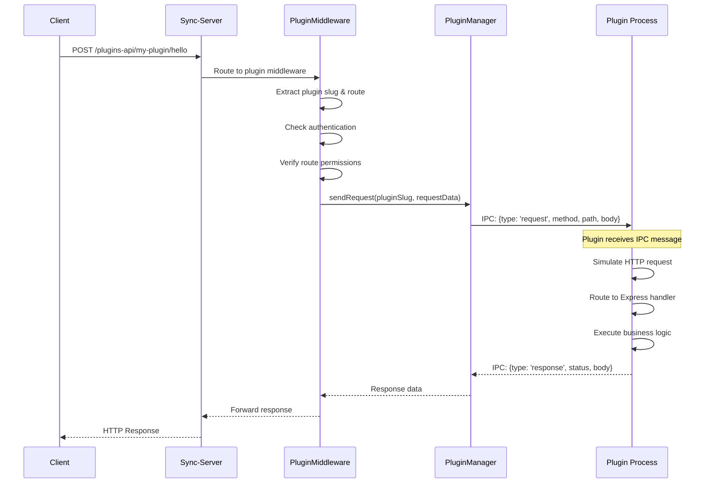
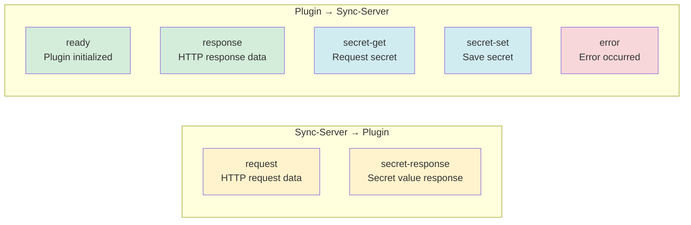
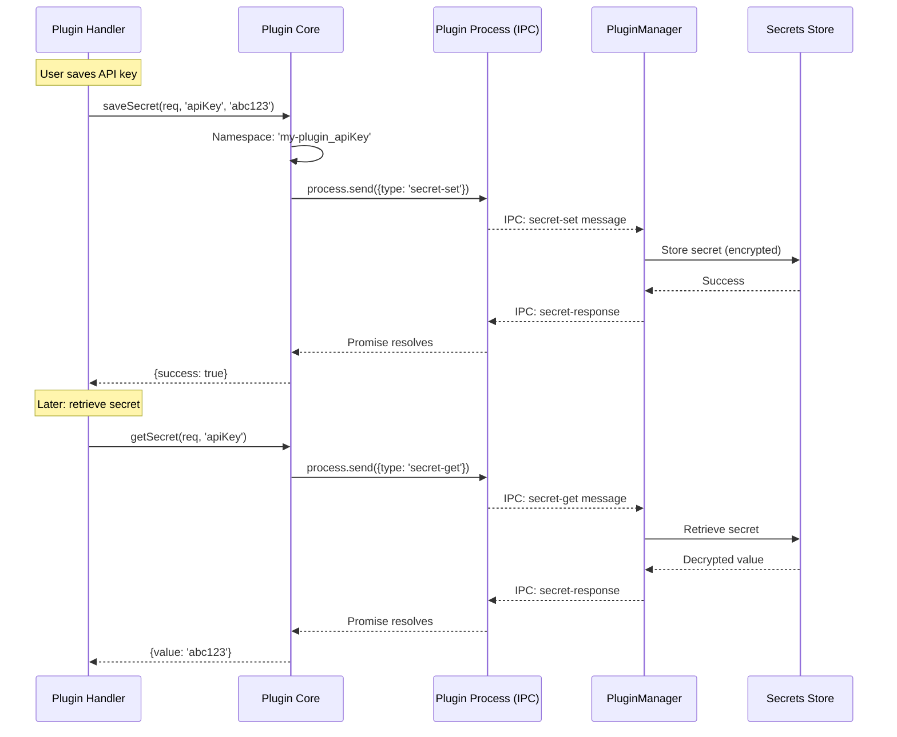
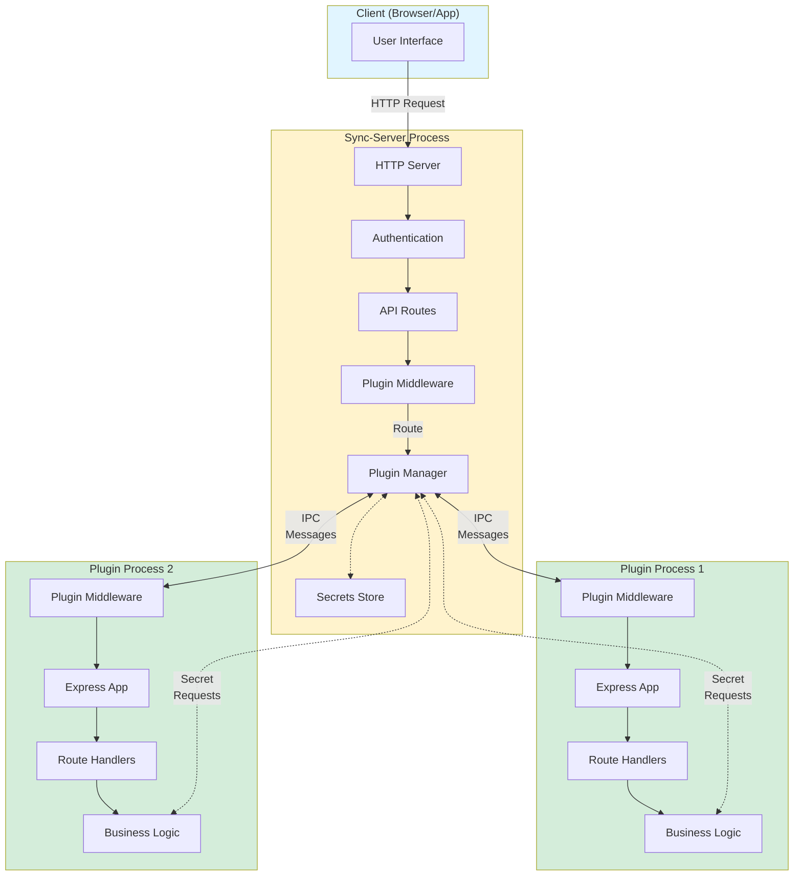

# Actual Budget Plugin Architecture

## Overview

Actual Budget's plugin system enables extending the sync-server with custom functionality through isolated, sandboxed processes. Plugins run as separate Node.js child processes that communicate with the sync-server via Inter-Process Communication (IPC).

## Key Concepts

### Plugin Structure

A plugin is a standalone Node.js application that:

- **Runs as a child process** forked from the sync-server
- **Uses Express.js** to define HTTP-like routes
- **Communicates via IPC** instead of network sockets
- **Has isolated dependencies** and runtime environment

### Core Components

1. **Plugin Manager** (`sync-server`) - Discovers, loads, and manages plugin lifecycle
2. **Plugin Middleware** (`sync-server`) - Routes HTTP requests to appropriate plugins via IPC
3. **Plugin Core Library** (`@actual-app/plugins-core-sync-server`) - Utilities for plugin authors
4. **Plugin Process** - Your custom plugin code running as a child process

---

## Plugin Development

### 1. Project Setup

```bash
# Create plugin directory
mkdir my-plugin
cd my-plugin

# Initialize npm project
npm init -y

# Install dependencies
npm install express @actual-app/plugins-core-sync-server
npm install -D typescript @types/express @types/node
```

### 2. Create Manifest

Every plugin needs a `manifest.ts` file that describes the plugin:

```typescript
import { PluginManifest } from '@actual-app/plugins-core-sync-server';

export const manifest: PluginManifest = {
  name: 'my-plugin',
  version: '1.0.0',
  description: 'My awesome plugin',
  entry: 'dist/index.js',
  author: 'Your Name',
  license: 'MIT',
  routes: [
    {
      path: '/hello',
      methods: ['GET', 'POST'],
      auth: 'authenticated', // or 'anonymous'
      description: 'Hello endpoint',
    },
  ],
  bankSync: {
    // Optional: for bank sync plugins
    enabled: true,
    displayName: 'My Bank Provider',
    description: 'Connect accounts via my provider',
    requiresAuth: true,
    endpoints: {
      status: '/status',
      accounts: '/accounts',
      transactions: '/transactions',
    },
  },
};

export default manifest;
```

### 3. Create Plugin Code

```typescript
import express from 'express';
import {
  attachPluginMiddleware,
  saveSecret,
  getSecret,
} from '@actual-app/plugins-core-sync-server';

const app = express();

// Essential: Parse JSON request bodies
app.use(express.json());

// Essential: Enable IPC communication with sync-server
attachPluginMiddleware(app);

// Define your routes
app.get('/hello', (req, res) => {
  res.json({ message: 'Hello from plugin!' });
});

app.post('/save-config', async (req, res) => {
  const { apiKey } = req.body;

  // Save secrets (encrypted & user-scoped)
  await saveSecret(req, 'apiKey', apiKey);

  res.json({ success: true });
});

app.get('/config', async (req, res) => {
  // Retrieve secrets
  const result = await getSecret(req, 'apiKey');

  res.json({ configured: !!result.value });
});

// No need to call app.listen() - IPC handles communication
console.log('My plugin loaded successfully');
```

### 4. Build Configuration

```json
{
  "scripts": {
    "build": "tsc && node build-manifest.js",
    "dev": "tsc --watch"
  }
}
```

The build process should:

1. Compile TypeScript to JavaScript
2. Convert `manifest.ts` to `manifest.json`

---

## Plugin Loading Process



### Loading Sequence Diagram



---

## Communication Architecture

### HTTP Request Flow

When a client makes a request to a plugin endpoint:



### IPC Message Types



---

## Secrets Management

Plugins can store encrypted, user-scoped secrets (API keys, tokens, etc.):



**Key Features:**

- **User-scoped**: Each user has their own secrets
- **Encrypted**: Stored securely in the database
- **Namespaced**: Automatically prefixed with plugin slug
- **Async**: Uses IPC promises for retrieval

---

## Plugin Architecture Diagram



---

## Bank Sync Plugins

Bank sync plugins follow a specific contract to integrate with Actual's account linking:

### Required Endpoints

1. **`/status`** - Check if plugin is configured

   ```json
   Response: {
     "status": "ok",
     "data": { "configured": true }
   }
   ```

2. **`/accounts`** - Fetch available accounts

   ```json
   Response: {
     "status": "ok",
     "data": {
       "accounts": [
         {
           "account_id": "ext-123",
           "name": "Checking",
           "institution": "My Bank",
           "balance": 1000,
           "mask": "1234",
           "official_name": "Primary Checking",
           "orgDomain": "mybank.com",
           "orgId": "bank-001"
         }
       ]
     }
   }
   ```

3. **`/transactions`** - Fetch transactions

   ```json
   Request: {
     "accountId": "ext-123",
     "startDate": "2024-01-01"
   }

   Response: {
     "status": "ok",
     "data": {
       "transactions": {
         "booked": [...],
         "pending": [...]
       }
     }
   }
   ```

---

## Best Practices

### 1. Error Handling

```typescript
app.post('/endpoint', async (req, res) => {
  try {
    const result = await doSomething();
    res.json({ status: 'ok', data: result });
  } catch (error) {
    res.json({
      status: 'error',
      error: error instanceof Error ? error.message : 'Unknown error',
    });
  }
});
```

### 2. Input Validation

```typescript
app.post('/config', async (req, res) => {
  const { apiKey } = req.body;

  if (!apiKey || typeof apiKey !== 'string') {
    return res.json({
      status: 'error',
      error: 'apiKey is required',
    });
  }

  // Process...
});
```

### 3. Logging

```typescript
// Plugin stdout/stderr is visible in sync-server logs
console.log('[MY-PLUGIN] Processing request...');
console.error('[MY-PLUGIN] Error occurred:', error);
```

### 4. Graceful Shutdown

```typescript
process.on('SIGTERM', () => {
  console.log('[MY-PLUGIN] Shutting down...');
  // Cleanup resources
  process.exit(0);
});
```

---

## Deployment

### File Structure

```
sync-server/
└── user-files/
    └── plugins-api/
        └── my-plugin/
            ├── manifest.json
            ├── package.json
            ├── node_modules/
            └── dist/
                └── index.js
```

### Installation Steps

1. **Build the plugin** (as ZIP or folder)
2. **Place in plugins-api directory**
3. **Restart sync-server** (auto-loads on startup)

### ZIP Format (Recommended)

```
my-plugin.zip
├── manifest.json
├── package.json
├── node_modules/
└── dist/
    └── index.js
```

The plugin manager automatically extracts ZIPs to a temporary directory.

---

## Troubleshooting

### Plugin Not Loading

- Check `manifest.json` exists and is valid JSON
- Verify `entry` field points to correct file
- Check sync-server logs for error messages

### IPC Communication Failures

- Ensure `attachPluginMiddleware(app)` is called
- Verify plugin sends `ready` message within 10s timeout
- Check that `process.send` is available (forked process)

### Route Not Found

- Verify route is defined in `manifest.json`
- Check authentication requirements match
- Ensure route path matches exactly (case-sensitive)

### Secrets Not Persisting

- Confirm user is authenticated
- Check `pluginSlug` is passed in request context
- Verify secrets store is properly initialized

---

## Example: Complete Bank Sync Plugin

See the [Pluggy.ai plugin](packages/bank-sync-plugin-pluggy.ai/) for a full working example that demonstrates:

- Authentication and configuration
- Account fetching with proper typing
- Transaction synchronization
- Secret management
- Error handling
- TypeScript usage

---

## API Reference

### `attachPluginMiddleware(app: Express)`

Enables IPC communication for the plugin. Must be called before defining routes.

### `saveSecret(req: Request, key: string, value: string)`

Saves an encrypted, user-scoped secret.

### `getSecret(req: Request, key: string)`

Retrieves a secret by key.

### `saveSecrets(req: Request, secrets: Record<string, string>)`

Saves multiple secrets at once.

### `getSecrets(req: Request, keys: string[])`

Retrieves multiple secrets at once.

---

## Security Considerations

1. **Process Isolation** - Each plugin runs in its own process
2. **Route Authentication** - Manifest declares auth requirements
3. **Secret Encryption** - All secrets encrypted at rest
4. **User Scoping** - Secrets isolated per user
5. **Namespace Isolation** - Secrets auto-prefixed with plugin slug
6. **No Direct DB Access** - Plugins can't access database directly
7. **Controlled IPC** - Only specific message types allowed
