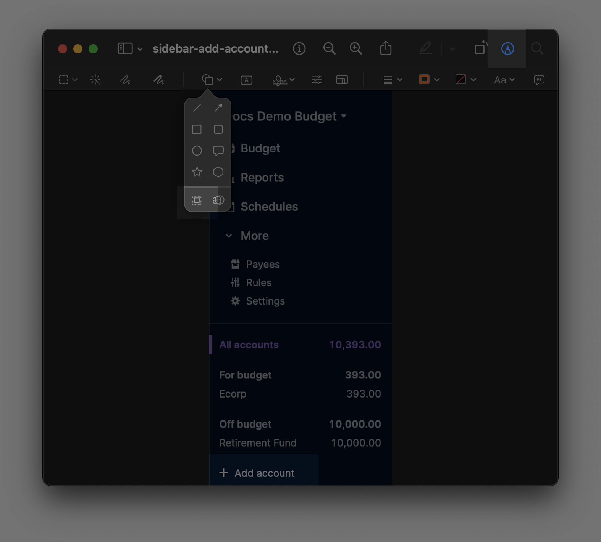

# Actual Budget Community Documentation

This repo forms the basis for what will become the new Actual Budget community documentation website, this is built using [Docusaurus 2](https://docusaurus.io/), a modern static website generator.

[Docusaurus 2](https://docusaurus.io/) uses NodeJS so if you are running Actual on your local machine you should be able to easily run [Docusaurus 2](https://docusaurus.io/)

## Contributing

Firstly, thankyou for stopping by and giving up some of your time to either check out the documentation we have already produced or pick off some of the [issues](https://github.com/actualbudget/docs/issues) and help create some new documentation for our future users.

### Installation Methods

Actual Budget can be installed on many different platforms, however at this time the official Actual Budget documentation only supports the following methods

- Local Installation (on your own machine)
- Fly.io
- PikaPods
- Docker

If you would like to write documentation for another installation variant, please feel free to continue to do this and host it on your own personal blog, medium, Tumblr or any other short form publication service and we will be more than happy to add a link to that from our documentation, open a [PR](https://github.com/actualbudget/docs/pulls) and add it to the list in the [installation overview](https://github.com/actualbudget/docs/blob/master/docs/install/index.md).

However, in doing so you would become responsible for these instructions, if they become out of date or people want in-depth help with them we will point them to you for assistance if the community is unable to help and if lots of people report issues with them we may have to remove the link altogether.

## Document Standards

Below are some basic standards on how the documentation should be formatted, everyone has there own writing style but the layout of the documents should be the same across all documents.

### Language

When writing your documentation, please use the English language, at this time the documentation team doesn't have any translators available to translate documents into other languages but this is something we would like to do in the future.

Docusaurus 2 provide translation using [i8n](https://docusaurus.io/docs/i18n/introduction), if this is something you would like to pursue, please feel free to open a PR.

### Documentation Structure

Below is the documentation structure for the Actual Community Docs.

```
website # the root directory of the documentation site
├── docs
│   └── index.md # the introduction file
    └── Getting Started
        └── Migration
        └── Installing # Documentation around installing actual
            └── Fly # sub folders for each installation method when the method has multiple files
            └── Synology
            ... # If the installation method only has one file, leave it in root of Installing
    └── Budgeting
        └── Rules
        ...
    └── Accounts # Anything relating to accounts, account management or transactions
        ...
    └── Budgeting # Budget specific, including rules, schedules etc.
        ...
    └── Reports # Just reporting
        ...
    └── Backup & Restore # Self explanatory title
        ...
    └── Developers # Documentation for developers, API etc.
        ...
    └── Other # Anything that doesn't fit above
        ...
    └── Troubleshooting # Self explanatory title
        ...
│
└── static
    └── img
```

### Document Frontmatter

Front matter is used to add metadata to your documentation file, the front matter is used to enrich the default metadata inferred from the content or other configuration.

```markdown
---
title: My Doc Title
more_data:
  - Can be provided
  - as: objects
    or: arrays
---
```

### Document Headings

The below shows how a document should be laid out.

`# A single heading`

Each document should only have one single heading, when a title is not provided in the front matter of the document, the heading provided is used instead and displayed in the documentation tree.

`## Sub Headings to split out sections of your document`

Sub headings are used to split the document into meaningful "chapters" these are then used in the right side bar when viewing a document to allow the reader to easily navigate the document content.

`### Section sub headings.`

Each "chapter" can then be split into sub sections using three gate headings.

### When Using Images

> Screenshots taken on a retina screen should be titled as such: image-name@2x.png
> This allows Docusaurus to rescale the images where appropriate.

When using images, ensure that the image is large and clear, if the image contains multiple items and buttons, highlight the area you are talking about (as shown below) or create arrows on the image to point to the part you are discussing. Where possible images should be saved as `PNG` format.

The clearest way to highlight areas on a screenshot is the 'transparency' box.



If a transparency box isn't available in your image editor, use an arrow or a colored box with hex: `#d5805a` / rgb: `213, 128, 90` (an analogous shade of orange to Actual's purple). If it's not practical to be that precise, just pick one as close as you can.

#### Generic Images and Directory Structures

In order to minimize the workload for adding images and make updating images easier, there's a directory containing regularly used images.

For example, many feature instructions may first require the user to navigate to a standard menu, eg

> "Click on 'Settings' in the sidebar"  
> [inserted image of the settings button in the sidebar]

In this case the relavent screenshot is found at `/static/img/elements/sidebar/sidebar-settings@2x.png`, along with all other possible menu selections in the sidebar.

If there's an image missing from any of the respective folders in `elements/`, feel free to add one yourself following the same naming scheme.

All other screenshots for the page you are working on should be placed in the respective folder in the `img/` directory. eg, when working on a page titled 'cool-feature', images should be placed in the `static/img/cool-feature/` folder.

### Call Outs

If you would like to highlight a section of your document with a note, you can use the following

```markdown
:::notes
Your note content
:::
```

If you want to make a reader aware of a cautionary item in your documentation, you can use this.

```markdown
:::caution
Your cautionary item
:::
```

### Quotes & Code Blocks

Using quotes within your documentation is easy to do using

```markdown
> Your quote goes here
> another line of your quote
> and another
```

If you want to use code in your documentation, that is easy too.

```js
console.log('Every repo must come with a mascot.');
```

### Issues

If you know of a part of Actual that isn't documented and you would like to know more about that part of the software, open an [Issue](https://github.com/rich-howell/actual-community-docs/issues) and one of the documentation team will get to it, or have a go at writing it yourself, we could really use all the help we can get.

### Pull Requests

When submitting a pull request, please make sure that your contributions are complete, I am checking this repo regularly so if I see a open PR the likelihood of me pulling it and merging it are high.

Documentation submitted will be proof read and amended before merging, please don't take this personally if any of your documentation gets amended, we just want to make sure all documents are ready to go before merging them into main.

### Installing the docs

Firstly, pull this repo into a local area on your machine, navigate to that directory and run the following command.

```
$ yarn
```

### Local Development

To start [Docusaurus 2](https://docusaurus.io/) navigate to the folder where the repo resides from a command prompt and issue the following command.

```
$ yarn start
```

This command starts a local development server and opens up a browser window. Most changes are reflected live without having to restart the server.

### Build

```
$ yarn build
```

This command generates static content into the `build` directory and can be served using any static contents hosting service.

### Deployment

Using SSH:

```
$ USE_SSH=true yarn deploy
```

Not using SSH:

```
$ GIT_USER=<Your GitHub username> yarn deploy
```

If you are using GitHub pages for hosting, this command is a convenient way to build the website and push to the `gh-pages` branch.

### Writing Good Release Notes

This is detailed in the [contributing](https://actualbudget.org/docs/contributing/#writing-good-release-notes) section of the documentation.
