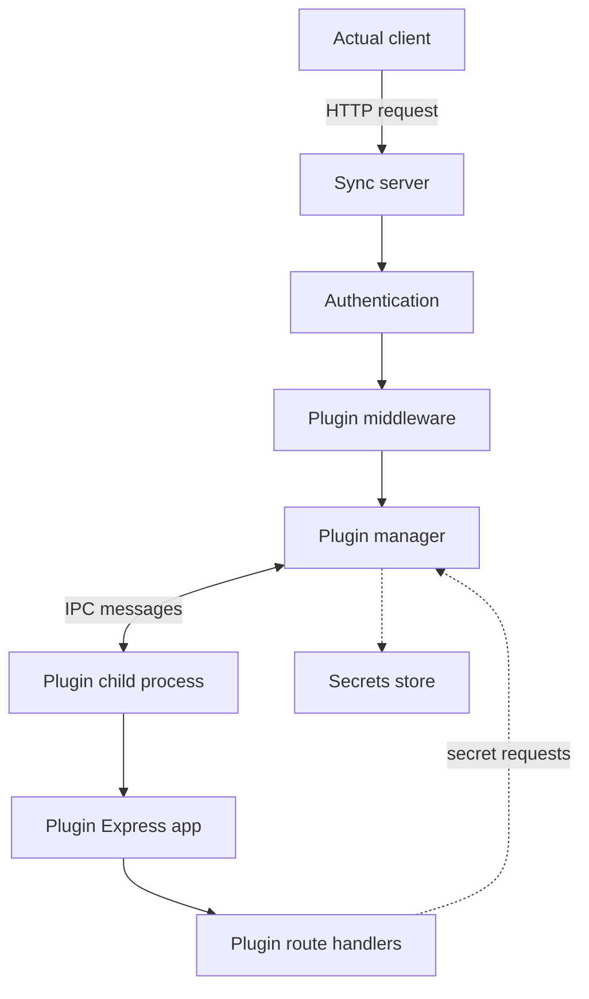
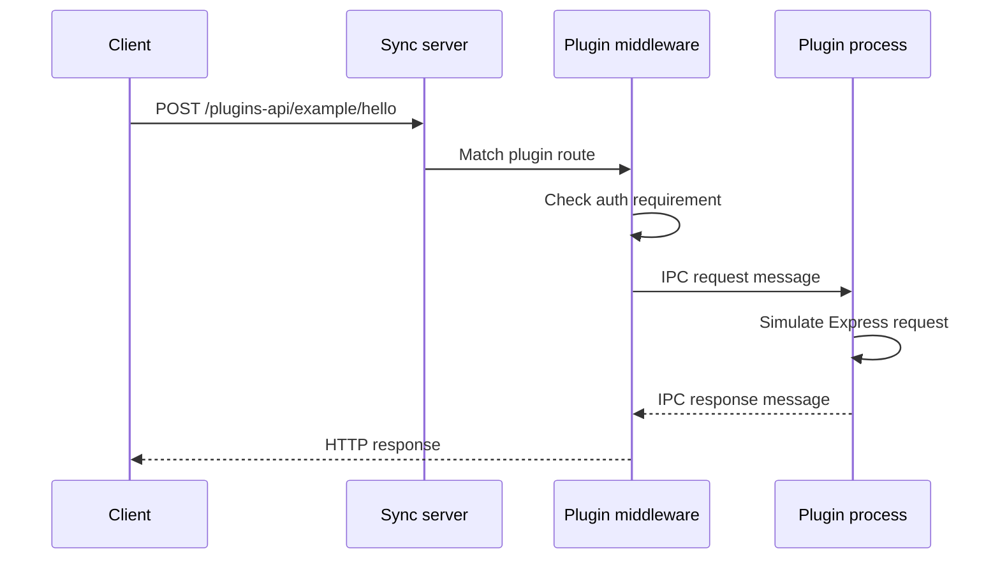
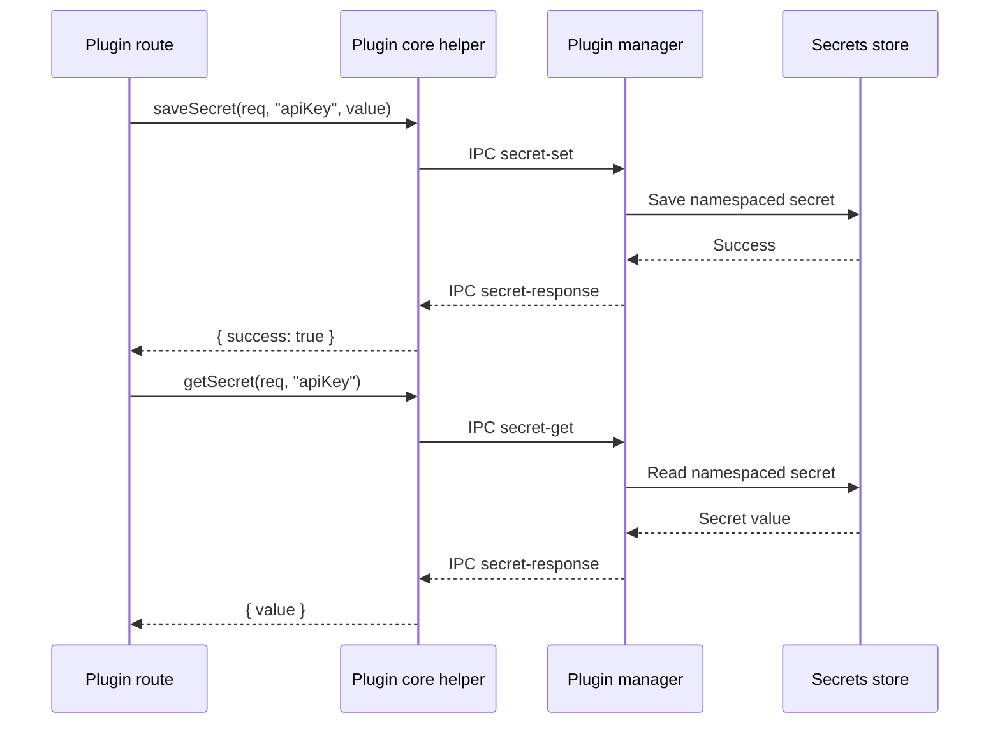

# Plugins

:::warning
This is an **experimental feature**. That means we're still working on finishing it. There may be bugs, missing functionality or incomplete documentation, and we may decide to remove the feature in a future release. If you have any feedback, please comment on [this feedback issue](https://github.com/actualbudget/actual/issues/5950) or post a message in the Discord.
:::

:::warning
All functionality described here may not be available in the latest stable release. See [Experimental Features](/docs/experimental/) for instructions to enable experimental features. Use the `nightly` images for the latest implementation.
:::

Back up your data before enabling plugins, and only install plugins from sources you trust.

The current plugin system supports installable packages that can add frontend code, sync-server code, or both. The active implementation is focused on plugin-backed bank sync providers. Broader extension points exist in the codebase as planned future capabilities, but they are not enabled in the current MVP.

## Enable plugins

Plugins have two separate switches:

- The Actual client experimental feature flag controls whether the Plugins page and plugin frontend code load.
- The sync server preference controls whether sync-server plugin processes load.

For frontend-only plugins, enable the client feature flag:

1. In Actual, go to `Settings -> Show advanced settings -> Experimental features`.
2. Click `I understand the risks, show experimental features`.
3. Enable `Plugins`.

:::warning
If you enable plugins from the Actual client, restart the sync server before installing or loading sync-server plugins. The sync server only loads plugins on startup.
:::

For sync-server or mixed plugins, also enable plugins on the sync server and restart it:

```bash
yarn workspace @actual-app/sync-server enable-plugins
```

To disable sync-server plugins:

```bash
yarn workspace @actual-app/sync-server disable-plugins
```

Restart the sync server after either command. These commands update the server preference `flags.plugins`.

## Disable or remove a plugin

For plugins stored in the browser, go to `More -> Plugins`. Use the pause button to enable or disable a plugin, or the trash button to delete it. Actual reloads the page after changing a local plugin state.

Sync-server plugins are server managed. They appear on the Plugins page, but their row does not expose pause or delete actions. To stop loading sync-server plugins, disable the server plugin preference and restart the sync server. To remove one sync-server plugin, delete its directory or zip file from the sync-server plugins folder and restart the sync server.

## Install plugins from the UI

After enabling the `Plugins` experimental feature, open `More -> Plugins`.

Use `Upload plugin manually` to choose a plugin `.zip` file. Actual reads `manifest.json` from the zip, validates it, and installs it according to its type:

- Frontend-only plugins are stored in the browser's IndexedDB plugin store.
- Sync-server and mixed plugins are uploaded to the configured sync server through `/plugins-api/install`.

Sync-server and mixed plugins require a configured sync server. The install endpoint requires admin access.

The zip must contain `manifest.json`. Frontend files must be under `frontend/`, and sync-server files must be under `syncserver/`.

## Install plugins by dropping files into the plugins folder

Sync-server plugins can also be installed by placing plugin files directly in the sync-server plugins directory.

The directory is:

```text
<ACTUAL_SERVER_FILES>/plugins
```

If `ACTUAL_SERVER_FILES` is not set, it defaults to:

```text
<ACTUAL_DATA_DIR>/server-files/plugins
```

In many Docker installs this is:

```text
/data/server-files/plugins
```

You can drop either:

- A plugin zip file ending in `.zip`.
- A plugin directory containing `manifest.json`.

Then restart the sync server. On startup, the plugin manager scans the plugins directory, validates each manifest, extracts zip plugins to a temporary directory, installs runtime dependencies from `package.json` when present, and starts sync-server plugins as child processes.

If two plugins have the same slug, Actual loads the first one found and skips the duplicate. The slug is the manifest `name` with unsupported characters replaced by `-`.

## Architecture

The plugin system has four main components:

- **Plugin manager**: discovers plugins, validates manifests, starts sync-server plugins, tracks loaded plugin processes, and shuts them down.
- **Plugin middleware**: routes HTTP requests under `/plugins-api` to the correct plugin process.
- **Plugin core libraries**: expose plugin author utilities such as frontend registration, IPC middleware, and secret helpers.
- **Plugin process**: sync-server plugin code running as a separate Node.js child process.

Frontend plugin code is loaded by the Actual client when the `plugins` feature flag is enabled. The client reads locally stored plugins from IndexedDB, fetches sync-server plugin manifests from `/plugins-api/list`, and merges both lists. Frontend plugin files are served through the plugin service worker under `/plugin-data/<plugin>/<file>`. The plugin frontend entry is loaded with Module Federation.

Sync-server plugin code is loaded by the sync server when the server `flags.plugins` preference is enabled. The sync server scans `<ACTUAL_SERVER_FILES>/plugins`, validates plugin manifests, and forks each sync-server plugin entry as a child process. Requests to plugin routes are forwarded to the child process over IPC. Plugin responses are forwarded back as HTTP responses.



## Plugin loading flow

On startup, the sync server loads plugins in this order:

1. Initialize the plugin manager with `<ACTUAL_SERVER_FILES>/plugins`.
2. Scan the directory for plugin folders and `.zip` files.
3. Read and validate each `manifest.json`.
4. Skip invalid plugins and duplicate slugs.
5. Extract zip plugins to a temporary directory.
6. Install plugin runtime dependencies from `package.json` when present.
7. Fork each sync-server plugin entry point.
8. Wait for the plugin to call `attachPluginMiddleware(app)` and send a `ready` IPC message.
9. Mark the plugin as online.

Plugins that do not send the `ready` message within the startup timeout are rejected.

## Request flow

Requests to plugin routes use HTTP at the sync-server boundary and IPC inside the sync server:



The sync server sends request messages containing the HTTP method, route path, headers, query, body, user information, and plugin slug. The plugin responds with status, headers, and body.

## Bank sync bridge

The bank sync bridge exposes standard routes for plugin bank sync providers:

```text
GET  /plugins-api/bank-sync/list
GET  /plugins-api/bank-sync/:providerSlug/status
POST /plugins-api/bank-sync/:providerSlug/status
POST /plugins-api/bank-sync/:providerSlug/accounts
POST /plugins-api/bank-sync/:providerSlug/transactions
POST /plugins-api/bank-sync/:providerSlug/secret
```

Additional provider-specific routes can be called through:

```text
/plugins-api/bank-sync/:providerSlug/<route>
```

Plugin routes can require `anonymous`, `authenticated`, or `admin` access. If a route omits `auth`, it defaults to authenticated access.

Bank sync plugins should expose these endpoint contracts through the paths declared in `syncserver.bankSync.endpoints`:

- `status`: returns whether the provider is configured.
- `accounts`: returns external accounts that can be linked.
- `transactions`: returns transactions for a linked external account.

Example status response:

```json
{
  "status": "ok",
  "data": {
    "configured": true
  }
}
```

Example accounts response:

```json
{
  "status": "ok",
  "data": {
    "accounts": [
      {
        "account_id": "external-account-1",
        "name": "Checking",
        "institution": "Example Bank",
        "balance": 1000
      }
    ]
  }
}
```

Example transactions response:

```json
{
  "status": "ok",
  "data": {
    "transactions": {
      "booked": [],
      "pending": []
    }
  }
}
```

## Manifest format

Every plugin must include `manifest.json`.

```json
{
  "name": "example-bank-sync",
  "version": "0.0.1",
  "description": "Example bank sync plugin",
  "author": "Example Author",
  "type": "mixed",
  "frontend": {
    "entry": "frontend/mf-manifest.json"
  },
  "syncserver": {
    "entry": "syncserver/index.js",
    "routes": [
      {
        "path": "/status",
        "methods": ["GET", "POST"],
        "auth": "authenticated",
        "description": "Check provider status"
      }
    ],
    "bankSync": {
      "enabled": true,
      "displayName": "Example Bank",
      "description": "Link accounts with Example Bank.",
      "requiresAuth": true,
      "setup": {
        "type": "plugin"
      },
      "endpoints": {
        "status": "/status",
        "accounts": "/accounts",
        "transactions": "/transactions"
      }
    }
  }
}
```

`type` must be one of:

- `frontend`: loads only frontend plugin code.
- `syncserver`: loads only sync-server plugin code.
- `mixed`: loads frontend code and sync-server code.

If the plugin has frontend code, `frontend.entry` is required. If the plugin has sync-server code, `syncserver.entry` is required. Bank sync setup with `"type": "plugin"` requires a `mixed` plugin because the setup UI is rendered by the frontend plugin.

## Create a bank sync plugin

The current plugin API is best suited to bank sync providers. The Enable Banking and Pluggy.ai packages are useful references.

A sync-server plugin creates an Express app and attaches the plugin IPC middleware:

```ts
import {
  attachPluginMiddleware,
  saveSecret,
  getSecret,
} from '@actual-app/plugins-core-sync-server';
import express from 'express';

const app = express();
app.use(express.json());
attachPluginMiddleware(app);

app.get('/status', async (req, res) => {
  const secret = await getSecret(req, 'apiKey');
  res.json({ status: 'ok', data: { configured: Boolean(secret.value) } });
});

app.post('/configure', async (req, res) => {
  await saveSecret(req, 'apiKey', req.body.apiKey);
  res.json({ status: 'ok', data: { configured: true } });
});
```

Secrets are namespaced by plugin slug automatically. If the request includes `x-actual-file-id` or a `fileId` query/body value, secrets are scoped to that budget file.

Secret helpers use IPC to ask the sync server to read or write values through the server secrets service. Plugins should use these helpers instead of storing provider credentials in their own files.



A frontend plugin exports an `ActualPluginEntry` and registers bank sync setup and link UI:

```tsx
import { initializePlugin } from '@actual-app/plugins-core';
import type { ActualPlugin, ActualPluginEntry } from '@actual-app/plugins-core';

const pluginEntry: ActualPluginEntry = () => {
  const plugin: ActualPlugin = {
    name: 'example-bank-sync',
    version: '0.0.1',
    install() {},
    uninstall() {},
    activate(context) {
      const unregisterSetup = context.registerBankSyncProviderSetup(
        'example-bank-sync',
        props => <ExampleSetup {...props} />,
      );

      const unregisterLink = context.registerBankSyncProviderLink(
        'example-bank-sync',
        props => <ExampleLink {...props} />,
      );

      return () => {
        unregisterSetup();
        unregisterLink();
      };
    },
    deactivate() {},
  };

  return initializePlugin(plugin);
};

export default pluginEntry;
```

The setup renderer receives `callProvider`, `setSecret`, `fileId`, `onSuccess`, `onError`, and `close`. The link renderer receives `callProvider`, `openExternalUrl`, `selectExternalAccounts`, `fileId`, and account-linking callbacks.

## Register a bank provider setup modal

For bank sync providers with `"setup": { "type": "plugin" }`, the frontend plugin is responsible for rendering the setup UI. Actual opens that UI from the Bank Sync page when the user chooses to configure the plugin provider.

Register the setup modal during plugin activation:

```tsx
import { I18nextProvider } from 'react-i18next';

import { initializePlugin } from '@actual-app/plugins-core';
import type {
  ActualPlugin,
  ActualPluginEntry,
  BankSyncProviderSetupRenderProps,
  PluginContext,
} from '@actual-app/plugins-core';

import { manifest } from '../src/manifest';

function ProviderSetup(props: BankSyncProviderSetupRenderProps) {
  // Render provider-specific inputs here.
}

const pluginEntry: ActualPluginEntry = () => {
  const plugin: ActualPlugin = {
    name: manifest.name,
    version: manifest.version,
    install() {},
    uninstall() {},
    activate(context: PluginContext) {
      const I18nWrapper = ({ children }: { children: React.ReactNode }) => (
        <I18nextProvider i18n={context.i18nInstance}>
          {children}
        </I18nextProvider>
      );

      const unregisterSetup = context.registerBankSyncProviderSetup(
        manifest.name,
        props => (
          <I18nWrapper>
            <ProviderSetup {...props} />
          </I18nWrapper>
        ),
        {
          containerProps: {
            style: { width: 420 },
          },
        },
      );

      return () => {
        unregisterSetup();
      };
    },
    deactivate() {},
  };

  return initializePlugin(plugin);
};

export default pluginEntry;
```

The provider slug passed to `registerBankSyncProviderSetup` should match the manifest `name`. That same slug is used in `/plugins-api/bank-sync/:providerSlug/...` routes.

The optional third argument is modal configuration. It uses Actual's basic modal props, so plugins can set modal container width, loading state, close behavior, and related modal options.

Inside the setup component, use the props supplied by Actual instead of calling sync-server URLs directly:

```tsx
import { useState } from 'react';

import {
  ButtonWithLoading,
  FormError,
  Input,
  ModalButtons,
  ModalCloseButton,
  ModalHeader,
  Text,
  View,
} from '@actual-app/plugins-core';
import type { BankSyncProviderSetupRenderProps } from '@actual-app/plugins-core';

export function ProviderSetup({
  callProvider,
  close,
  fileId,
  onError,
  onSuccess,
}: BankSyncProviderSetupRenderProps) {
  const [apiKey, setApiKey] = useState('');
  const [error, setError] = useState('');
  const [isSaving, setIsSaving] = useState(false);

  async function save() {
    if (!apiKey) {
      setError('API key is required.');
      return;
    }

    setIsSaving(true);

    try {
      const response = await callProvider({
        path: 'configure',
        method: 'POST',
        body: {
          fileId,
          apiKey,
        },
      });

      if (response && typeof response === 'object' && 'error' in response) {
        throw new Error(String(response.error));
      }

      setError('');
      onSuccess();
      close();
    } catch (error) {
      setError(error instanceof Error ? error.message : String(error));
      onError(error);
    } finally {
      setIsSaving(false);
    }
  }

  return (
    <>
      <ModalHeader
        title="Set up Example Bank"
        rightContent={<ModalCloseButton onPress={close} />}
      />
      <View style={{ display: 'flex', gap: 10, padding: 20, minWidth: 360 }}>
        <Text>Enter your provider API key.</Text>
        <Input
          type="password"
          value={apiKey}
          onChangeValue={value => {
            setApiKey(value);
            setError('');
          }}
        />
        {error && <FormError>{error}</FormError>}
      </View>
      <ModalButtons>
        <ButtonWithLoading
          variant="primary"
          type="button"
          autoFocus
          isDisabled={isSaving}
          isLoading={isSaving}
          onPress={() => {
            void save();
          }}
        >
          Save and continue
        </ButtonWithLoading>
      </ModalButtons>
    </>
  );
}
```

`callProvider` sends the request through Actual's bank sync plugin bridge. For a setup component, it automatically includes the current provider slug and budget file context. The `path` value is appended to `/plugins-api/bank-sync/:providerSlug/`, so `path: 'configure'` calls the plugin's `/configure` route.

Use `setSecret` only when the setup UI needs to store a simple key/value secret directly. For provider-specific validation, prefer a plugin route such as `/configure`; the sync-server plugin can validate credentials and then call `saveSecret`.

## Best practices

Wrap plugin route handlers in explicit error handling and return structured responses:

```ts
app.post('/endpoint', async (req, res) => {
  try {
    const result = await doSomething(req.body);
    res.json({ status: 'ok', data: result });
  } catch (error) {
    res.json({
      status: 'error',
      error: error instanceof Error ? error.message : 'Unknown error',
    });
  }
});
```

Validate request bodies before calling external APIs or saving secrets:

```ts
app.post('/configure', async (req, res) => {
  const { apiKey } = req.body ?? {};

  if (!apiKey || typeof apiKey !== 'string') {
    res.json({
      status: 'error',
      error: 'apiKey is required',
    });
    return;
  }

  await saveSecret(req, 'apiKey', apiKey);
  res.json({ status: 'ok', data: { configured: true } });
});
```

Do not call `app.listen()`. The sync server forks the plugin process and communicates with the Express app through IPC.

Plugin stdout and stderr are visible in sync-server logs. Prefix logs with the plugin name to make troubleshooting easier.

Handle shutdown signals if the plugin owns resources that need cleanup:

```ts
process.on('SIGTERM', () => {
  console.log('[example-bank-sync] Shutting down...');
  process.exit(0);
});
```

## Build a plugin zip

A distribution zip should use this layout:

```text
manifest.json
package.json
frontend/
  mf-manifest.json
  ...
syncserver/
  index.js
```

For mixed bank sync plugins in this repository, the usual build flow is:

```bash
yarn workspace @actual-app/bank-sync-plugin-enablebanking build
```

That build compiles TypeScript, bundles the sync-server entry with esbuild, builds the frontend Module Federation bundle with Vite, writes `manifest.json`, and creates the zip.

During local plugin development, the Plugins page also exposes a development plugin URL field when Actual runs in development mode. The URL can point to `manifest.json` or to a directory containing `manifest.json`. If the dev plugin includes sync-server code, Actual registers it with the sync server through `/plugins-api/dev/register`.

## Current capabilities

The current implementation supports:

- Frontend, sync-server, and mixed plugin manifests.
- Manual zip upload from the Plugins page.
- Loading sync-server plugins from zip files or directories in the sync-server plugins folder.
- Module Federation based frontend plugin loading.
- Express-based sync-server plugin routes over IPC.
- Route auth levels: `anonymous`, `authenticated`, and `admin`.
- Plugin-specific secret storage through the sync server secrets service.
- Plugin bank sync providers with setup, account-linking, account-list, status, and transaction endpoints.
- A CORS proxy for plugin store and GitHub release access, guarded by an allowlist.
- Development plugin loading from a local manifest URL.

## Troubleshooting

If a plugin does not load:

- Check that server plugins are enabled and the sync server was restarted.
- Check that `manifest.json` exists and is valid JSON.
- Check that the manifest `type`, `frontend.entry`, and `syncserver.entry` are valid.
- For zip installs, check that frontend files live under `frontend/` and sync-server files live under `syncserver/`.
- Check the sync-server logs for validation errors, dependency install errors, startup timeout errors, or duplicate slug warnings.

If IPC communication fails:

- Ensure the sync-server plugin calls `attachPluginMiddleware(app)`.
- Ensure the plugin process is forked by the sync server; direct `node syncserver/index.js` execution will not have `process.send`.
- Ensure the plugin sends its `ready` message within the startup timeout.

If a route returns 404:

- Confirm the plugin is online.
- Confirm the route path starts with `/` and matches the manifest exactly.
- Confirm the request method is listed in the route's `methods`.
- Confirm the caller satisfies the route's auth level.

If secrets do not persist:

- Use `saveSecret`, `getSecret`, `saveSecrets`, and `getSecrets` from `@actual-app/plugins-core-sync-server`.
- Confirm the request includes the plugin context. Requests forwarded through `/plugins-api` include the plugin slug automatically.
- For budget-scoped provider secrets, confirm the request includes `x-actual-file-id` or `fileId`.

## Security considerations

Plugins are powerful and should be treated like server-side code:

- Each sync-server plugin runs in its own child process, but it is not a complete security sandbox.
- Plugin routes should declare the narrowest useful auth level.
- Secrets should be stored through the sync-server secrets helpers, not plugin-local files.
- Secrets are namespaced by plugin slug.
- Current plugins do not have direct access to the Actual database through the public plugin API.
- IPC only supports specific message types handled by the plugin manager.
- Only install plugins from sources you trust.

## Planned future capabilities

Several broader plugin capabilities are present as part of a fuller plugin system, but are not currently enabled. These include:

- Custom app routes.
- Slot content in locations such as the main menu, more menu, account sidebar areas, and topbar.
- Plugin modals and navigation helpers outside the bank sync flow.
- Plugin event subscriptions for payees, categories, and accounts.
- Plugin dashboard widgets.
- Plugin-provided themes and theme color overrides (to be removed in favor of custom themes).
- Plugin databases, transactions, metadata, migrations, and AQL queries.
- Spreadsheet helpers and filter-building helpers.

Treat these as future directions, not as stable APIs.
